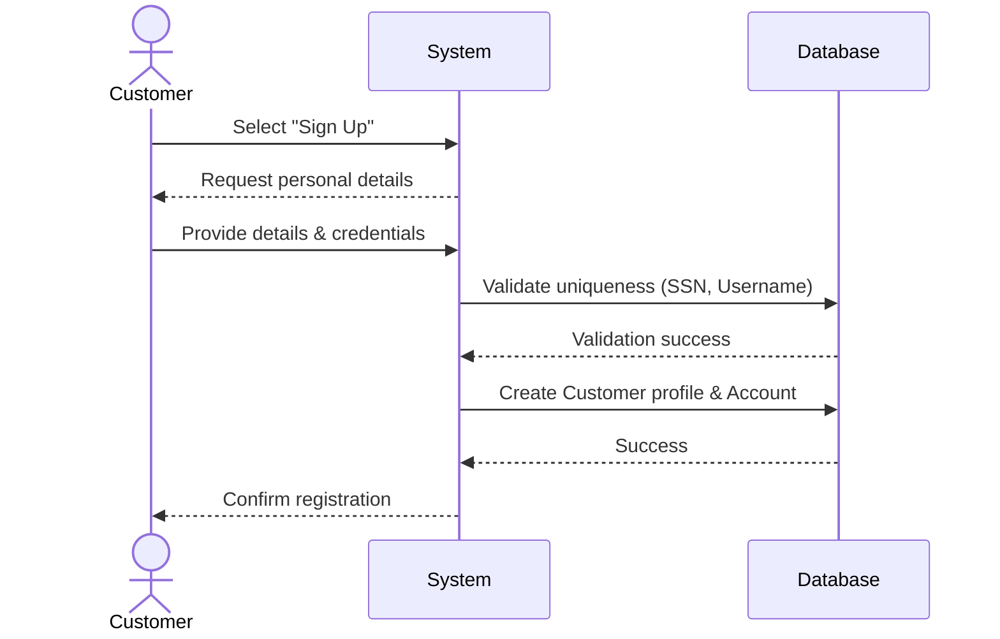
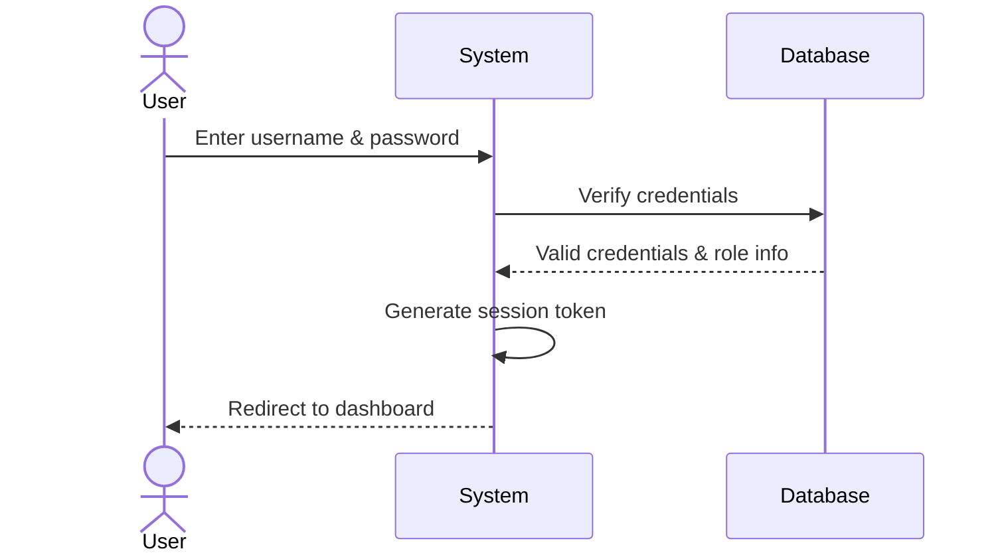
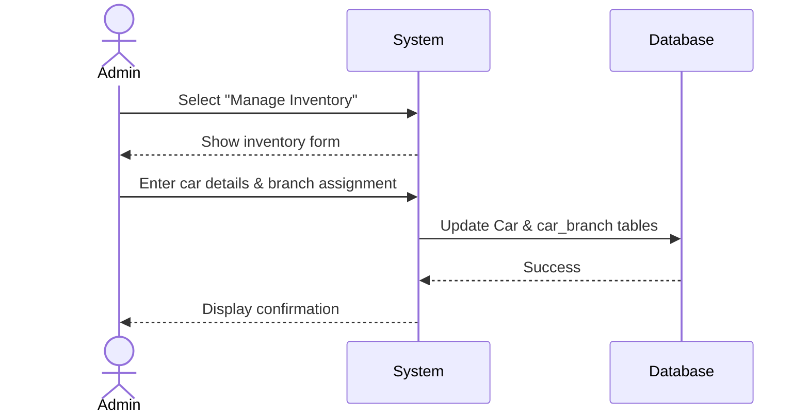
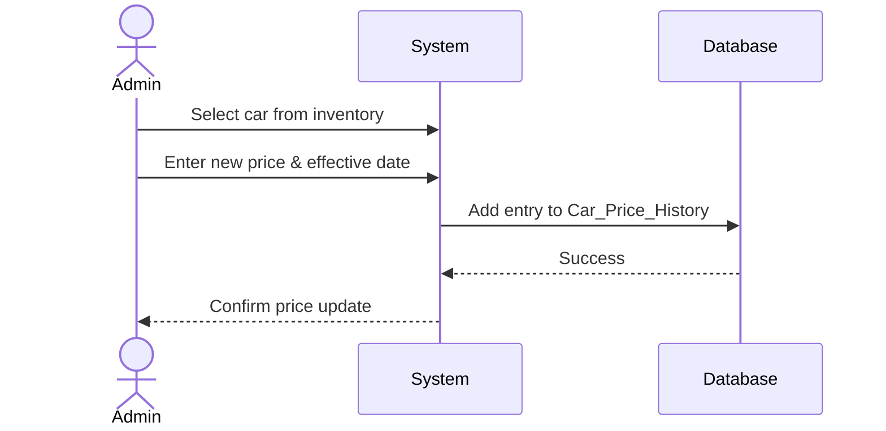
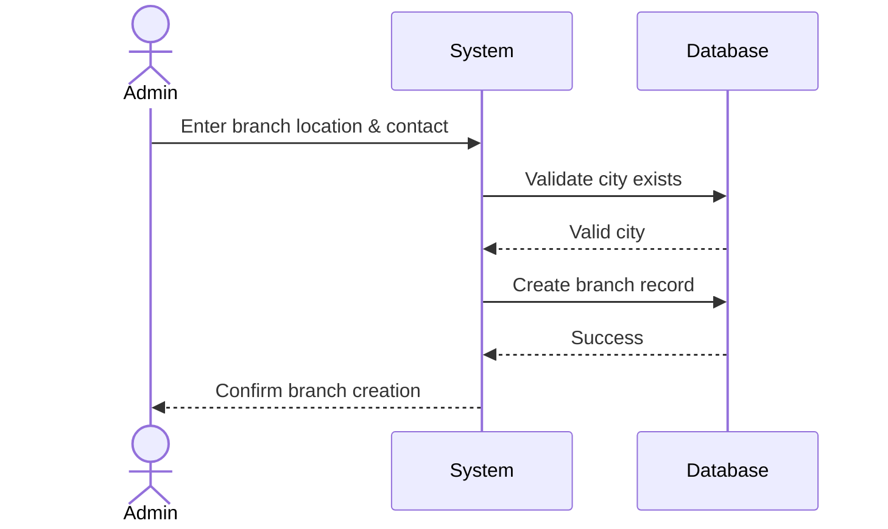
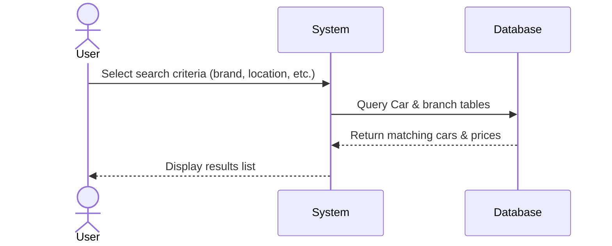
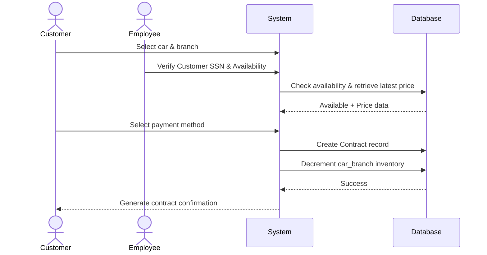

# Sequence Diagrams for Car Showroom Use Cases

This file contains sequence diagrams for the primary use cases of the Car Showroom Management System. You can copy the Mermaid code blocks below and paste them into [draw.io](https://app.diagrams.net/) (via **+** > **Advanced** > **Mermaid**) to generate the diagrams.

## UC-01: User Registration

---

## UC-02: User Login

---

## UC-03: Manage Car Inventory

---

## UC-04: Update Car Pricing

---

## UC-05: Manage Branches

---

## UC-06: Search & Filter Cars

---

## UC-07: Create Rental Contract

